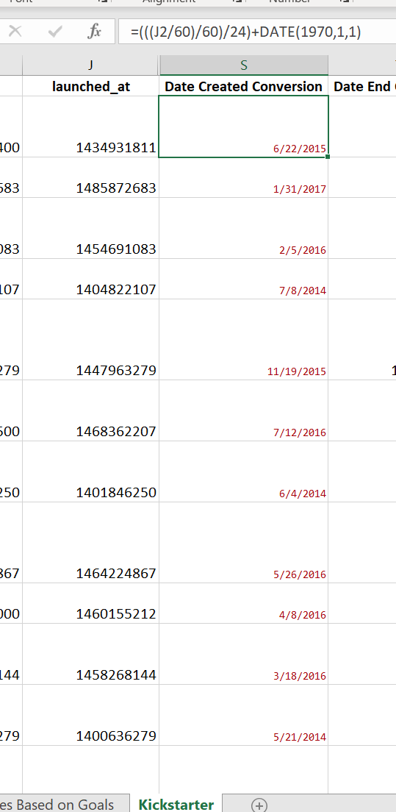

# kickstarter-analysis

##  Overview of Project
### Purpose
  The purpose of this analysis was to not only find which of the theater campaigns were either successful, failed, or canceled based on its launch date, but to also find the percentage of which play campaigns were either a success, failed, or cancelled based off funding goal amounts. 
  The background for this analysis was provided by the kickstarter worksheet within the Kickstarter_Challenge.xlsx, which reports details and outcomes for fundraising goals of different tv show kickstarter programs.

## Analysis
### Deliverable 1
  In order to find which of the theater campaigns were successful, failed, or canceled based on its launch date, we had to first create a years column using the "=Year" function. For this function to work, you have to use the "Date created Conversion" column which as created by converting the Unix timestamp located in the "launched_at" column.

")
  Once that is finished you then must create a line chart based off the pivot tale to determine theater campaigns outcomes based on its launch date. 
  To successfully analyze this dataset, we had to filter the pivot table by Parent Category and Years, set Outcomes to columns, set Date Created Conversions to rows, and place the values to list in each cell as the Count of (each possible) Outcome.

### Deliverable 2
  To find the percentage of which play campaigns were successful, failed, or canceled based on the funding goal amount, we had to first create a new worksheet to reflect this statistical analysis. Within "Outcomes based on Goals", we found the Number of Successful/Failed/Cancelled outcomes for each grouped goal amount using COUNTIF(). 
  Next, we summed up each of these groupings for the Total Projects by using SUM(). Then, we found each percentage by dividing each number of outcomes by the total projects seen within each respective group. 
  ")
  Finally, we created a line chart for each outcome based on goal groups. To successfully analyze this dataset, we had to make sure we had an understanding of how gather data for each outcome per goal group.

## Challenges
### Deliverable 1
  I did not have any challenges within Deliverable 1, however something that could have been a little difficult was making sure that the pivot table was created correctly in order to make the expected graph. Sometimes it can get tricky between what should be a row/column and what would be better as a filter.

### Deliverable 2
  One challenge that I had was finding the Number of Successful/Failed/Cancelled outcomes for each grouped goal amount using COUNTIF(). My biggest issue was trying to input the correct arguments for the criteria and criteria range. 
  To rectify this issue, I watched the video hint to get a good example as well as researched the function more in depth to get a better understanding of what information is purposed for the criteria and criteria range.

## Results
### Conclusions
  Two conclusions I found from deliverable 1 was that the month of May was the most successful and that there were not any canceled theater campaigns in October. 
  Based off of the Outcomes based on Goals’ dataset I conclude that 45,000 to 49,999 had the highest percentage of failed play campaigns. 
### Limitations
  A couple of limitation I noticed in this dataset are that, firstly, the pledged and goal columns are not consistent for one currency. For example, there are multiple types of currency present in the dataset without a universal currency conversion. 
  Another that I noticed was that it would interesting to know what demographics exist within this dataset as another possibly crucial observable.
### Other Visualizations
  Other table and graphs we can create are pie charts and bar charts to illustrate goal outcomes that were reached based on individual fundraiser's country, spotlight, and backers_count.
